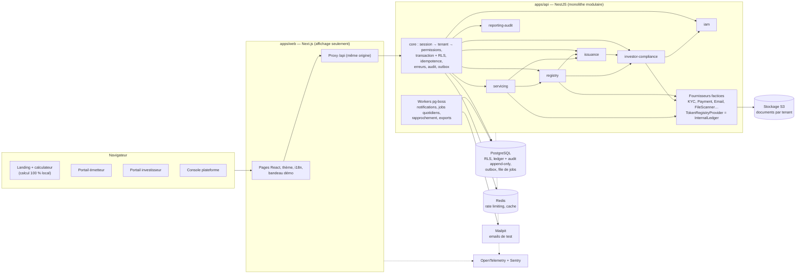

# Architecture technique — Virtus Assets

Livrables 2 (architecture technique), 3 (comparaison des technologies, synthèse), 6 (architecture front-end) et 7 (architecture back-end) de `docs/SPEC.md`.
Les décisions référencées `D-xxx` sont dans `docs/DECISIONS.md`. Modèle de données : `docs/DATA_MODEL.md`. API : `docs/API.md`.

---

## 1. Principes directeurs

1. **Monolithe modulaire** : un seul back-end déployable, six modules métier (section 5 de la spec) plus un noyau technique `core` (D-022). Frontières vérifiées automatiquement en CI.
2. **Le serveur décide, le front affiche** : permissions, isolation, transitions d'état, calculs et contrôles sont exclusivement côté API. Next.js n'accède jamais à la base (D-004).
3. **La base est la dernière ligne de défense** : RLS (filtrage des lignes par tenant), triggers append-only, contraintes `CHECK` sur les quantités, deux rôles PostgreSQL.
4. **Logique métier pure et testée** : machines à états, moteur d'éligibilité, calcul des coupons et règles d'allocation sont des fonctions sans accès à la base ni au framework.
5. **Tout ce qui est externe passe par une interface** avec une implémentation factice configurable (succès / refus / panne).
6. **Garde-fous automatiques** plutôt que discipline : lint, dependency-cruiser, tests d'autorisation générés depuis la matrice, test des clés de traduction, test des mots interdits (D-018).

---

## 2. Stack retenue (D-002)

| Couche | Choix | Rôle |
|---|---|---|
| Langage | TypeScript partout | Un seul langage, types partagés front/back |
| Runtime / monorepo | Node.js LTS, pnpm workspaces | Versions figées en phase 1 |
| Front | Next.js (App Router), React, Tailwind CSS, shadcn/ui | Landing, portails, console plateforme |
| Front — données | TanStack Query, client généré depuis OpenAPI (`openapi-typescript` + `openapi-fetch`) | Appels typés à l'API |
| Front — formulaires | React Hook Form + Zod | Validation en ligne |
| Front — tableaux / graphiques | `DataTable` maison (tri et pagination faits par l'API, D-027), Recharts | Data tables, KPI, calculateur |
| Front — i18n | next-intl | en-GB, fr-FR |
| Back | NestJS | Modules, injection de dépendances, guards, OpenAPI |
| Validation | Zod (pipe `ZodValidationPipe` maison) ; OpenAPI produit depuis les mêmes schémas via `z.toJSONSchema` | Entrées API, variables d'environnement, documentation. `nestjs-zod` écarté : incompatible avec NestJS 12 |
| Base | PostgreSQL (dernière version majeure stable, confirmée en phase 1) | RLS, NUMERIC, triggers |
| Accès aux données | Drizzle ORM + driver `pg` ; migrations Drizzle Kit + SQL manuel (RLS, triggers) | Requêtes typées proches du SQL |
| Décimaux | decimal.js | Aucun calcul en flottant |
| Authentification | Better Auth (dans l'API) + Argon2id | Sessions, mots de passe, TOTP, réinitialisation |
| Asynchrone | pg-boss (file de jobs dans PostgreSQL) + table `outbox_event` | Notifications, jobs quotidiens, exports |
| Cache / limitation de débit | Redis | Rate limiting, cache préfixé par tenant |
| Documents | Stockage compatible S3 (Garage en dev, D-005) + `@aws-sdk/client-s3` | Fichiers, URL temporaires |
| Emails | Mailpit (dev) derrière `EmailProvider` | Emails capturés localement |
| PDF | Bibliothèque de génération PDF légère côté serveur (choix vérifié en phase 11) | Confirmations d'allocation, avis de coupon |
| Observabilité | pino via `nestjs-pino` (logs JSON), OpenTelemetry, Sentry (région UE) | Logs, traces, erreurs |
| Tests | Vitest, Playwright | Unitaires, intégration (vrai PostgreSQL), bout en bout |
| Qualité | ESLint, Prettier, dependency-cruiser, TypeScript strict | CI bloquante |
| CI / sécurité | GitHub Actions, Dependabot, secret scanning | À chaque push |

### 2.1 Synthèse de la comparaison (livrable 3)

| Sujet | Retenu | Alternatives écartées | Raison principale |
|---|---|---|---|
| Front-end | Next.js | Vite SPA + Astro | Préférence du porteur ; un seul projet pour la landing et les portails ; proxy même origine |
| Back-end | NestJS | Fastify structuré à la main ; Django | Structure imposée = code homogène généré par IA ; même langage que le front |
| Base | PostgreSQL | MySQL / MariaDB | RLS exigée (section 20) indisponible ailleurs |
| Accès données | Drizzle | Prisma ; Kysely | Ledger, RLS, verrous et triggers restent du SQL lisible ; NUMERIC renvoyé en texte |
| Asynchrone | pg-boss | BullMQ + Redis | Une pièce de moins ; jobs sauvegardés avec la base ; cohérent avec l'outbox |
| Documents | S3 compatible | Stockage en base ; disque local | URL temporaires, fournisseurs européens interchangeables |
| Authentification | Better Auth | Keycloak ; Auth.js ; maison | Éprouvé, TypeScript, TOTP intégré ; Keycloak trop lourd pour le Codespace |
| Déploiement | Images Docker sur un VPS OVHcloud avec Docker Compose (D-095) | PaaS européen (Clever Cloud, Scaleway) ; Kubernetes ; offres gratuites | Seule option gardant PostgreSQL 18 et les quatre rôles sans changer le code ; administration couverte par des scripts (phase 16) |
| Monitoring | pino + OpenTelemetry + Sentry | Suite Grafana auto-hébergée | Standard neutre, mise en place rapide |

Points de vigilance : Drizzle est en 0.x et Better Auth en 1.x → versions figées, montées de version volontaires et testées.

---

## 3. Organisation du dépôt

```
virtus_assets/
├─ .devcontainer/            Codespaces : image, services, ports, 4 cœurs (D-008)
├─ .github/workflows/        CI : lint, typecheck, tests, e2e, contrôles de frontières
├─ docker-compose.yml        PostgreSQL, Redis, stockage S3, Mailpit (+ profil observability)
├─ .env.example              Valeurs factices ; .env ignoré par git
├─ apps/
│  ├─ web/                   Next.js
│  └─ api/                   NestJS (API + workers)
├─ packages/
│  ├─ shared/                Catalogue d'erreurs, statuts→couleur/libellé, helpers décimaux,
│  │                         codes de règles d'éligibilité, types générés depuis OpenAPI
│  └─ config/                Configurations ESLint, TypeScript, Prettier partagées
├─ infra/                    Configuration des services Docker (Garage…)
├─ scripts/                  Démarrage, initialisation du stockage, contrôle des mentions interdites
├─ tests/e2e/                Playwright : les six scénarios de la section 29
└─ docs/                     SPEC, DECISIONS, ARCHITECTURE, DATA_MODEL, API, BACKLOG
```

Pas de dossier `packages/contracts` (nom réservé par la spec aux contrats blockchain, interdits dans le MVP).

**Commandes cibles** (créées en phase 1, complétées ensuite) :

| Commande | Effet |
|---|---|
| `pnpm dev` | Démarre les services Docker, applique les migrations, lance l'API, les workers et le front |
| `pnpm db:reset` | Recrée la base de démo et recharge le jeu de données déterministe |
| `pnpm db:setup` | Crée ce qui manque (rôles, base, migrations, données de démo) ; idempotent, lancé par `pnpm dev` |
| `pnpm db:generate` | Écrit la migration SQL suivante à partir des définitions de tables ; `--custom` pour une migration de sécurité écrite à la main |
| `pnpm test` | Tests unitaires (sans service externe) |
| `pnpm test:integration` | Tests sur PostgreSQL réel : rôles, RLS, append-only, migrations rejouables |
| `pnpm test:e2e` | Scénarios Playwright |
| `pnpm lint` | Lint, format, frontières entre modules, mots interdits |

**Ports** : web 3000 ; API 4000 (non exposée publiquement, appelée via le proxy du front) ; Mailpit 8025 (interface) ; stockage S3 (Garage) 3900 ; PostgreSQL 5432 et Redis 6379 internes.

---

## 4. Architecture back-end (livrable 7)

### 4.1 Modules et responsabilités

| Module (dossier) | Schéma PostgreSQL | Responsabilités |
|---|---|---|
| `iam` | `iam` (+ tables Better Auth) | Tenants, utilisateurs, rôles, permissions, invitations d'utilisateurs, sessions, MFA, verrouillage de compte, accès break-glass |
| `investor-compliance` | `investor` | Investisseurs, représentants, bénéficiaires effectifs, dossiers KYC/KYB, évaluations d'éligibilité, moteur d'éligibilité, codes destinataires (D-010) |
| `issuance` | `issuance` | Émissions, termes, règles d'éligibilité de l'émission, assistant, machine à états, invitations d'investisseurs (whitelist) |
| `registry` | `registry` | Souscriptions, paiements de souscription fictifs, allocations, comptes logiques, positions, ledger, transferts, snapshots, rapprochement |
| `servicing` | `servicing` | Échéanciers de coupons, distributions, lignes de distribution, instructions de paiement fictives, remboursement du principal |
| `reporting-audit` | `reporting` (vues) | Dashboards, indicateurs, exports CSV/PDF, consultation de l'audit, file « À traiter » |
| `core` (technique, D-022) | `core`, `audit` | Contexte de requête, transactions, idempotence, audit (écriture), outbox, transitions de workflow, documents, notifications, référentiels, fournisseurs |

### 4.2 Dépendances autorisées

Un module ne peut appeler que les modules listés, **uniquement via leur fichier public `index.ts`** ; jamais leurs tables ni leur code interne. Tous peuvent utiliser `core`. Aucun cycle.

| Module | Peut appeler |
|---|---|
| `iam` | — |
| `investor-compliance` | `iam` |
| `issuance` | `investor-compliance`, `iam` |
| `registry` | `issuance`, `investor-compliance`, `iam` |
| `servicing` | `registry`, `issuance`, `iam` |
| `reporting-audit` | tous (lecture seule, via leurs interfaces de requête) |

Dans l'autre sens (un module amont veut réagir à un module aval), on passe par un **événement interne** publié dans l'outbox. Exemple : `registry` publie `SubscriptionSubmitted`, les notifications réagissent.

Règles appliquées par dependency-cruiser en CI :
- `modules/X/**` ne peut importer `modules/Y/**` que via `modules/Y/index.ts`, et seulement si Y est autorisé pour X ;
- `modules/*/domain/**` n'importe ni NestJS, ni Drizzle, ni `core/infrastructure` (logique pure) ;
- `core/**` n'importe aucun module.

Au niveau base, les clés étrangères entre schémas sont autorisées (intégrité), la lecture croisée ne l'est pas.

### 4.3 Structure interne d'un module

```
apps/api/src/modules/registry/
├─ index.ts            API publique du module (services et types exportés)
├─ registry.module.ts  Déclaration NestJS
├─ domain/             Pur : machines à états, invariants, calculs, erreurs métier
├─ application/        Cas d'usage : orchestrent domaine + dépôts + audit + outbox
├─ infrastructure/     Dépôts Drizzle, schéma des tables du module
└─ api/                Contrôleurs REST, DTO Zod, décorateurs de permission
```

### 4.4 Cycle de vie d'une requête

```mermaid
sequenceDiagram
  participant B as Navigateur
  participant W as Next.js (proxy /api)
  participant A as API NestJS
  participant P as PostgreSQL
  B->>W: POST /api/v1/transfers/{id}/approve (cookie, Idempotency-Key)
  W->>A: relaie la requête (même origine)
  A->>A: 1. Correlation ID (lu ou créé)
  A->>A: 2. Contrôle Origin + rate limiting
  A->>A: 3. Session → utilisateur → tenant → permissions (refus par défaut)
  A->>A: 4. Guard de permission (transfer:approve) + validation Zod
  A->>P: 5. BEGIN ; set_config('app.tenant_id', …, true)
  A->>P: 6. Idempotence : clé déjà vue ? → réponse stockée
  A->>P: 7. Cas d'usage : verrous, écritures, audit, outbox
  A->>P: 8. Enregistrement de la réponse idempotente ; COMMIT
  A-->>B: 200 + X-Correlation-Id
```

- Le **contexte de requête** (tenant, utilisateur, rôles, permissions, correlation ID, transaction) circule via `AsyncLocalStorage` : aucun service ne reçoit de `tenant_id` en paramètre venant du client.
- Un `tenantId` d'un **autre** tenant présent dans le corps ou la query est refusé en **404** et la tentative est tracée (`TENANT_OVERRIDE_ATTEMPT`, D-035) ; celui de l'utilisateur est retiré du corps. Une route qui aurait besoin d'un tenant venant de la requête doit être marquée `@AcceptsTenantParameter` (aucune aujourd'hui).
- Une ressource d'un autre tenant est invisible (RLS) → **404** `RESOURCE_NOT_FOUND`, et le refus est tracé dans l'audit via une transaction séparée.
- Les lectures s'exécutent aussi dans une transaction courte (lecture seule) pour bénéficier de la RLS.

### 4.5 Isolation multi-tenant (défense en profondeur)

1. **Applicatif** : le tenant vient de la session, jamais de la requête.
2. **RLS PostgreSQL** sur toutes les tables métier : politique `tenant_id = core.current_tenant_id()` (lecture de `app.tenant_id`, positionné par `withTenantTransaction` pour la seule transaction), `FORCE ROW LEVEL SECURITY`. Chaque nouvelle table est enregistrée dans une migration « de sécurité » écrite à la main, via les fonctions `core.enable_tenant_isolation()` et `core.make_append_only()` ; les tests d'intégration échouent si une table portant `tenant_id` n'est pas protégée.
3. **Quatre rôles PostgreSQL** :
   - `va_migrator` : propriétaire des schémas, utilisé uniquement par les migrations et le seed ;
   - `va_app` : utilisé par l'API et les workers ; pas propriétaire, pas `BYPASSRLS`, **aucun droit UPDATE ni DELETE** sur `registry.ledger_entry` et `audit.audit_event` ;
   - `va_auth` (D-030) : réservé au composant d'authentification ; lit les utilisateurs avant que le tenant soit connu (politique RLS dédiée), seul à accéder aux sessions, mots de passe et secrets TOTP ; aucun droit sur les tables métier ;
   - `va_jobs` (D-039) : utilisé par pg-boss ; propriétaire du seul schéma `pgboss` ; aucun droit sur les tables métier. `va_app` peut y lire les files et y ajouter des tâches, rien d'autre.
4. **Triggers** refusant UPDATE et DELETE sur les tables append-only, même pour le propriétaire.
5. **Stockage** : chemins `tenants/{tenantId}/…`, URL signées de courte durée (5 minutes).
6. **Cache Redis** : clés préfixées `t:{tenantId}:`.
7. **Tests** : un test vérifie que la RLS est active sur chaque table portant `tenant_id` ; le scénario 5 appelle chaque endpoint avec des identifiants de l'autre tenant.

**Platform Administrator** : n'a pas de tenant courant, donc ne voit aucune donnée métier. Pour gérer les organisations, les routes `/tenants` ouvrent une transaction « portée plateforme » (`app.platform_scope = 'on'`) qui active une politique RLS dédiée sur `iam.tenant` seulement (D-036). Ses indicateurs de plateforme proviennent de vues agrégées sans donnée métier. L'accès break-glass (phase 16, D-034) crée une autorisation temporaire (1 heure, motif obligatoire, lecture seule), tracée dans l'audit du tenant concerné.

### 4.6 Registre et ledger

- **Comptes logiques** par émission : un compte `ISSUER_TREASURY` et un compte `INVESTOR` par investisseur détenteur.
- **Création des unités** : à la validation de l'allocation, un mouvement `ISSUANCE` crée le nombre total d'unités sur le compte de trésorerie ; `ALLOCATION` les déplace vers les comptes investisseurs (puis `BLOCK`, D-009). Les unités non vendues restent en trésorerie et ne reçoivent pas de coupon.
- **Mouvements** (source → destination) :

| Type | Source | Destination | Effet sur la position |
|---|---|---|---|
| ISSUANCE | — | trésorerie | détenu + |
| ALLOCATION | trésorerie | investisseur | détenu − / + |
| BLOCK | compte | même compte | bloqué + |
| UNBLOCK | compte | même compte | bloqué − |
| TRANSFER | investisseur A | investisseur B | détenu − / + |
| REDEMPTION | compte | — | détenu − |
| CANCELLATION | investisseur | trésorerie | détenu − / + |
| CORRECTION | selon le cas | selon le cas | contre-écriture ; référence l'écriture corrigée |

- **Écriture** : un seul service `LedgerWriter` (dans `registry`) écrit les mouvements et met à jour les positions **dans la même transaction**. Il verrouille la ligne `ledger_head` de l'émission (`SELECT … FOR UPDATE`) pour sérialiser les écritures, calcule le numéro de séquence et le hash chaîné, puis met à jour les positions (version incrémentée).
- **Hash** : `entry_hash = SHA-256(previous_hash ‖ représentation canonique de l'écriture)` ; la première écriture d'une émission part d'un hash nul.
- **Invariants** (section 10.4) :
  1. `CHECK` en base : détenu ≥ 0, bloqué ≥ 0, bloqué ≤ détenu ; disponible = colonne calculée ;
  2. et 3. vérifiés dans le cas d'usage avant commit, puis par le job de rapprochement quotidien ;
  4. droits PostgreSQL + triggers ;
  5. chaînage vérifié par le job de rapprochement.
- `TokenRegistryProvider` expose `createAsset`, `mint`, `transfer`, `burn`, `freeze`, `unfreeze`, `getBalance`, `getTransactionStatus` ; `InternalLedgerProvider` les implémente au-dessus de `LedgerWriter`. Aucune autre implémentation n'est codée dans le MVP.

### 4.7 Montants, quantités et dates

- Base : `NUMERIC` ; JSON : chaînes (`"2500.00"`) ; code : `Decimal` (decimal.js, précision 40 chiffres significatifs, arrondi `ROUND_HALF_EVEN`).
- Montant = objet `{ amount: string, currency: string }`. Les décimales de chaque devise viennent du référentiel ISO 4217 (`core.currency`).
- Règle ESLint interdisant `parseFloat`, `Number(...)` et les opérateurs arithmétiques sur les variables typées montant ou quantité (liste précise établie en phase 2).
- Taux stocké en fraction (`0.05` pour 5 %), affiché en pourcentage.
- Dates métier en `date` ; « aujourd'hui » calculé dans le fuseau du tenant (D-015) ; timestamps techniques `timestamptz` UTC.

### 4.8 Idempotence

- En-tête `Idempotency-Key` (UUID) **obligatoire** sur les actions financières (liste dans `docs/API.md`), facultatif ailleurs.
- Table `core.idempotency_key` : unique par (tenant, utilisateur, clé) ; stocke l'empreinte de la requête et la réponse ; durée de conservation 24 h.
- Même clé + même requête → même réponse, sans nouvel effet. Même clé + requête différente → `422 IDEMPOTENCY_KEY_REUSED`. Requête encore en cours → `409 IDEMPOTENCY_IN_PROGRESS`.
- L'enregistrement de la clé et l'opération métier sont dans la même transaction : toute la requête s'exécute dans une transaction unique, dont les transactions du code métier deviennent des points de sauvegarde (D-042). Seules les réponses réussies sont mémorisées ; une requête concurrente avec la même clé attend 3 secondes au plus.

### 4.9 Outbox, notifications et jobs

- Chaque cas d'usage écrit ses événements métier dans `core.outbox_event` **dans sa transaction**, avec la tâche pg-boss qui les livre (D-040). Un filet de sécurité (`outbox-sweep`, chaque minute) relance les événements restés en attente.
- Le worker `outbox-relay` (pg-boss, toutes les quelques secondes) lit les événements non traités, crée les notifications dans l'application et les emails, puis marque l'événement traité. Envoi « au moins une fois » ; les consommateurs sont idempotents (clé = identifiant de l'événement).
- Jobs planifiés (pg-boss) :

| Job | Fréquence | Effet |
|---|---|---|
| `kyc-expiry` | Quotidien | Passe en EXPIRED les KYC échus ; alerte à J-30 (investisseur + Compliance Officer) |
| `subscription-auto-close` | Quotidien (et au démarrage) | Ferme les souscriptions dont la date de fin est passée (fuseau du tenant) |
| `registry-reconciliation` | Quotidien | Vérifie les invariants 1, 2, 3 et 5 ; signale toute anomalie (audit + notification) |
| `idempotency-cleanup` | Quotidien | Purge les clés expirées |
| `export-generation` | À la demande | Génère les CSV/PDF volumineux et notifie |

- Les workers tournent dans le même code que l'API. En dev, ils sont dans le même processus ; en production, ils peuvent être lancés séparément (même image, autre point d'entrée).

### 4.10 Fournisseurs externes (section 27)

Interfaces dans `core/providers` : `KycProvider`, `IdentityProvider`, `PaymentProvider`, `CustodyProvider`, `ElectronicSignatureProvider`, `DocumentStorageProvider`, `EmailProvider`, `TokenRegistryProvider` (= BlockchainProvider), `MarketDataProvider`, `AccountingProvider`, `FileScanner`.
Implémentations factices sélectionnées par configuration, avec un mode `success | reject | outage` par fournisseur (variables `PROVIDER_<NOM>_MODE` ; en phase 8 : `PROVIDER_KYC_MODE`, `PROVIDER_FILE_SCANNER_MODE`). En mode `outage`, l'appel échoue avec `503 PROVIDER_UNAVAILABLE` ; un disjoncteur (circuit breaker) simple évite d'insister sur un fournisseur en panne.

### 4.11 Documents

Upload → contrôle de taille (10 Mo) → détection du type réel par le contenu (magic bytes) → `FileScanner` → calcul du checksum SHA-256 → stockage `tenants/{tenantId}/documents/{documentId}/v{version}` → métadonnées en base. Téléchargement via un lien signé de 5 minutes servi par l'API elle-même (D-045) ; le stockage n'est jamais exposé au navigateur ; les téléchargements de documents confidentiels sont tracés dans l'audit. Détection du type avec `file-type` (D-046). Les documents générés (PDF, CSV) portent la mention « Environnement de démonstration — données fictives ».

### 4.12 Authentification et sessions

- Better Auth (bibliothèque) dans le module `iam`, **jamais exposé directement** : les routes `/api/v1/auth/*` sont celles de l'API, qui appellent Better Auth côté serveur (D-031). Toutes les réponses suivent donc le format d'erreur de la spec, et l'API garde la main sur le blocage, la limitation de débit et l'audit. Inscription publique désactivée : les comptes naissent d'une invitation.
- Accès base : rôle `va_auth` (D-030).
- Mots de passe : Argon2id (19 Mio, 2 itérations), 12 à 128 caractères, refus des mots de passe courants (liste zxcvbn-ts, D-033), sans autre règle de complexité (spec 24).
- MFA TOTP (6 chiffres, 30 s) avec 10 codes de secours ; obligatoire pour Platform Administrator, Issuer Administrator et Compliance Officer : tant qu'elle n'est pas configurée, seules les routes d'enrôlement, `me` et la déconnexion répondent (`MFA_ENROLLMENT_REQUIRED`). Démo : D-016.
- Cookies `va.*` (`__Secure-va.*` en https), `HttpOnly`, `SameSite=Lax`, `Secure` en https ; nouvelle session à chaque connexion (D-003) ; expiration après 30 minutes d'inactivité (prolongée toutes les 5 minutes d'activité) et au plus tard après 12 heures.
- Blocage après 5 échecs consécutifs pendant 15 minutes (implémenté dans `iam`) ; limitation de débit Redis par adresse IP et par compte ; journal d'audit de chaque connexion, échec, second facteur, déconnexion et invitation (sans email ni secret).
- Garde global `AuthGuard` : toute route exige une session sauf celles marquées `@Public()`.
- Protection CSRF : même origine + `SameSite=Lax` + contrôle de l'en-tête `Origin` sur toute requête modifiante.
- Invitations (utilisateurs et investisseurs) : jeton à usage unique, haché en base, valable 7 jours.

### 4.13 Erreurs

Format de la section 22.2 de la spec. Les codes et leur statut HTTP sont définis dans `packages/shared/src/errors/error-codes.ts` (catalogue unique, traduit côté front). Toute exception non prévue devient `500 INTERNAL_ERROR`, sans détail technique dans la réponse ; le détail va dans les logs avec le correlation ID.

### 4.14 Observabilité

- Logs JSON (pino) avec `correlationId`, `tenantId`, `userId` ; masquage automatique des champs sensibles (liste centralisée : email, téléphone, identifiants fiscaux, noms de personnes, jetons, mots de passe).
- OpenTelemetry : traces HTTP, base de données et jobs ; export OTLP désactivé par défaut en dev, profil docker compose `observability` (`grafana/otel-lgtm`) pour les visualiser.
- Sentry (région UE) pour les erreurs front et back, activé par variable d'environnement.
- `GET /health` (vivant) et `GET /health/ready` (base, Redis, stockage joignables ; 503 si l'un ne répond pas en 2 secondes). Ces routes sont hors du préfixe `/api/v1` et ne sont pas relayées par le front.
- Les logs écrits pendant une requête portent uniquement `correlationId` (pas la requête entière) ; la ligne de fin de requête contient méthode, URL, statut et durée, avec cookies et en-tête `Authorization` masqués.

---

## 5. Architecture front-end (livrable 6)

### 5.1 Structure

```
apps/web/src/
├─ app/globals.css         Jetons du thème (couleurs, polices) : source unique
├─ app/[locale]/           Page d'accueil (landing en phase 15), 404 traduite
│  ├─ issuer/              Portail émetteur (layout = AppShell)
│  ├─ portal/              Portail investisseur
│  ├─ platform/            Console Platform Administrator
│  └─ (auth)/…             Connexion, MFA, invitation (phase 5)
├─ proxy.ts                Proxy Next.js 16 (ex-middleware) : préfixe de langue /en, /fr
├─ components/ui/          Primitives dans le style shadcn/ui, adaptées aux jetons
├─ components/app/         Composants transverses (section 23.2)
├─ features/<domaine>/     Écrans, hooks et formulaires par domaine (menus : features/navigation)
├─ lib/api/                Client généré depuis OpenAPI (phase 5, D-027)
└─ i18n/                   routing, navigation, request, messages/en-GB.json et fr-FR.json
```

### 5.2 Routes principales

Préfixe de langue dans l'URL : `/en/…` (en-GB) et `/fr/…` (fr-FR).

| Espace | Routes |
|---|---|
| Public | `/` (landing + calculateur), `/login`, `/login/mfa`, `/invitation/[token]`, `/reset-password` |
| Émetteur | `/issuer/dashboard`, `/issuer/tasks` (À traiter), `/issuer/issuances`, `/issuer/issuances/new` (assistant), `/issuer/issuances/[id]/[tab]`, `/issuer/investors`, `/issuer/investors/[id]`, `/issuer/subscriptions`, `/issuer/registry`, `/issuer/distributions`, `/issuer/documents`, `/issuer/reports`, `/issuer/audit`, `/issuer/settings` |
| Investisseur | `/portal/portfolio`, `/portal/portfolio/[positionId]`, `/portal/opportunities`, `/portal/subscriptions`, `/portal/transactions`, `/portal/distributions`, `/portal/documents`, `/portal/profile` |
| Plateforme | `/platform/tenants`, `/platform/tenants/[id]`, `/platform/metrics`, `/platform/templates`, `/platform/settings`, `/platform/break-glass` |

Onglets du détail d'une émission (section 13.4) : `overview`, `details`, `terms`, `subscriptions`, `investors`, `registry`, `transfers`, `distributions`, `documents`, `audit`, `settings`.

### 5.3 Règles

- **Pas de logique métier** : le front appelle l'API et affiche. Les règles de cohérence affichées en ligne dans l'assistant sont une aide ; l'API refait tous les contrôles.
- **Données** : TanStack Query pour le cache et les rechargements ; les filtres des listes sont conservés dans l'URL.
- **Menus** : construits à partir des permissions renvoyées par `GET /api/v1/auth/me` (confort d'affichage, jamais une sécurité).
- **Montants** : jamais convertis en nombre ; formatés via `Intl.NumberFormat` à partir de la chaîne, avec chiffres tabulaires.
- **Actions sensibles** : modale de confirmation qui rappelle ce qui va se passer ; l'`Idempotency-Key` est générée à l'ouverture de la modale, donc un double clic ne rejoue pas l'action.
- **Brouillons** : sauvegarde automatique de l'assistant d'émission (côté API) ; avertissement avant de quitter une page modifiée.
- **Bandeau démo** : composant `DemoBanner` rendu par les layouts authentifiés, non masquable.

### 5.4 Composants (section 23.2)

`AppShell`, `Sidebar`, `Header`, `DemoBanner`, `KpiCard`, `DataTable` (pagination, tri, filtres, recherche), `FilterBar`, `SearchBar`, `StatusBadge`, `Stepper`, `FormField`, `DatePicker`, `CurrencyInput` (saisie en chaîne), `QuantityInput` (entiers), `Drawer`, `ConfirmDialog`, `Tabs`, `Timeline`, `ActivityCard`, `FileUpload`, `NotificationBell`, `EmptyState`, `Skeleton`, `ErrorState` (affiche le message traduit + correlation ID), `Chart`, `AuditViewer`, `EligibilityResult` (règles passées/échouées avec motifs en clair).

### 5.5 Thème

- Jetons définis une seule fois dans `apps/web/src/app/globals.css` (bloc `@theme` de Tailwind CSS 4, qui génère les classes `bg-surface`, `text-muted`…) ; aucun code couleur ni style en ligne dans les composants (règle ESLint).
- Valeurs : section 23.1 de la spec, plus les jetons de texte accessibles proposés en D-021.
- Mode sombre par défaut (seul mode du MVP).
- Typographie : Montserrat (titres), Inter (texte, tableaux, `font-variant-numeric: tabular-nums`), servies localement via `next/font`.
- Un test calcule le contraste WCAG de chaque paire texte/fond déclarée et échoue sous 4,5:1 (3:1 pour les grands textes).

### 5.6 Statuts et traductions

- `packages/shared/status` : pour chaque statut (émission, souscription, KYC, éligibilité, transfert, distribution), un jeton de couleur et une clé de traduction. Fichier unique utilisé par `StatusBadge`.
- next-intl ; toutes les chaînes dans `en-GB.json` et `fr-FR.json`. Un test échoue si une clé manque dans l'une des deux langues, et le test des mots interdits (D-018) parcourt ces fichiers.
- Les messages d'erreur sont traduits à partir du code d'erreur (`errors.<CODE>`).

### 5.7 Landing et calculateur

- Reprise du prototype HTML (D-019) en composants React, dans l'espace `(public)`, rendue statiquement.
- Calculateur 100 % navigateur ; hypothèses (gain de temps, coût de la plateforme) centralisées dans `apps/web/src/features/calculator/assumptions.ts`, visibles et modifiables par le visiteur ; calculs en décimal ; avertissement « estimations indicatives ».
- Aucune donnée saisie n'est envoyée sans action explicite (formulaire de contact → email vers Mailpit en dev).

---

## 6. Stratégie de tests

| Niveau | Outil | Portée |
|---|---|---|
| Unitaires | Vitest | Machines à états, moteur d'éligibilité, calcul des coupons (dont le cas 2 500,00 €), fractions de période ACT/365F et 30E/360, arrondis, règles de l'assistant |
| Intégration | Vitest + PostgreSQL réel (service Docker en CI) | Ledger, invariants, append-only (UPDATE/DELETE refusés), RLS, idempotence, concurrence sur une même position |
| Autorisation | Vitest, générés depuis la matrice rôles × permissions | Chaque endpoint × chaque rôle ; chaque endpoint avec un identifiant de l'autre tenant |
| Front | Vitest + Testing Library | Composants clés, clés de traduction, contrastes |
| Bout en bout | Playwright | Scénarios 1 à 6 de la section 29 |

Couverture visée : 90 % pour `registry` et `servicing` (D-001), mesurée en CI.

---

## 7. Diagramme de composants



---

## 8. Environnement Codespaces

- `.devcontainer/devcontainer.json` : image Node LTS, pnpm, extensions VS Code utiles, `hostRequirements` à 4 cœurs (D-008), ports 3000 et 8025 transférés automatiquement.
- `docker-compose.yml` : PostgreSQL, Redis, stockage S3, Mailpit ; données de démo seulement.
- Les secrets éventuels passent par les *Codespaces secrets* de GitHub ; `.env.example` contient des valeurs factices.
- Budget mémoire indicatif (ordre de grandeur) : services Docker ~0,5 Go, API ~0,4 Go, front en dev ~1 à 1,5 Go, VS Code ~1,5 Go, navigateur Playwright pendant les tests ~0,5 Go.
