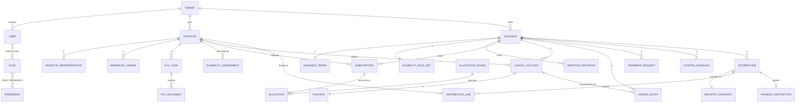

# Modèle de données — Virtus Assets

Livrable 4 de `docs/SPEC.md` : modèle conceptuel et logique, machines à états, matrice rôles × permissions.
Les noms de tables et de colonnes sont indicatifs ; ils sont finalisés dans les migrations de la phase 3 et des phases suivantes. Toute modification de fond est signalée.

---

## 1. Conventions (section 21.2 de la spec)

| Sujet | Règle |
|---|---|
| Identifiants | UUID v7 générés par PostgreSQL 18 (`uuidv7()`) quand l'application n'en fournit pas ; données de démo : UUID déterministes (D-024) |
| Montants | `NUMERIC(38,18)` + colonne `currency` (ISO 4217) à côté ; arrondi à la devise appliqué par le domaine |
| Quantités | `NUMERIC(38,18)` ; `CHECK (quantity = trunc(quantity))` pendant le MVP (unités entières, D-001) |
| Taux | `NUMERIC(12,10)` en fraction (`0.05` = 5 %) |
| Dates techniques | `timestamptz` (UTC) |
| Dates métier | `date` |
| Colonnes communes | `created_at`, `updated_at`, `created_by`, `version` (verrouillage optimiste) — sauf tables append-only |
| Suppression | Aucune suppression physique des données métier ; `archived_at` ou statut |
| Tenant | `tenant_id uuid NOT NULL` + RLS sur toute table métier |
| Append-only | Tables marquées **[AO]** : trigger refusant UPDATE/DELETE + aucun droit UPDATE/DELETE pour `va_app` |
| Données personnelles | Tables marquées **[DP]** : jamais référencées par le ledger, masquées dans logs et audit, pseudonymisables (`pseudonymized_at`) |
| Énumérations | Type `text` + `CHECK` (plus simple à faire évoluer qu'un type `ENUM` PostgreSQL) |

---

## 2. Modèle conceptuel

Toutes les entités de la section 21 de la spec sont présentes. Correspondances de noms :

| Spec | Modèle |
|---|---|
| IssuanceTerms | `issuance.issuance_terms` |
| EligibilityRule (1..N par émission) | `issuance.eligibility_rule_set` : un jeu de règles structuré et versionné par émission ; le moteur en déduit la liste des règles évaluées |
| Allocation | `registry.allocation` + `registry.allocation_round` (lot soumis à validation quatre yeux) |
| PaymentInstruction | `servicing.payment_instruction` (distributions) ; paiements de souscription dans `registry.subscription_payment` (le module `registry` ne peut pas dépendre de `servicing`) |
| WorkflowTransition | `core.workflow_transition` (toutes machines à états) |
| AuditEvent | `audit.audit_event` |
| ReferenceData | `core.country`, `core.currency`, `core.reference_data` |

---

## 3. Modèle logique par schéma

### 3.1 `core` et `audit` (noyau technique)

**`core.country`** (global) — `code` (ISO 3166-1 alpha-2, PK), `name_en`, `name_fr`.
**`core.currency`** (global) — `code` (ISO 4217, PK), `minor_units` (EUR = 2).
**`core.reference_data`** (global) — `id`, `category` (`ASSET_CATEGORY`, `LEGAL_FORM`, `INVESTOR_CLASSIFICATION`, …), `code`, `label_en`, `label_fr`, `active`.

**`core.idempotency_key`** — `id`, `tenant_id` (nullable pour les actions plateforme), `user_id`, `key`, `method`, `path`, `request_hash`, `status` (`IN_PROGRESS`, `COMPLETED`), `response_status`, `response_body` (jsonb), `created_at`, `expires_at`. Unique (`user_id`, `key`).

**`core.outbox_event`** — `id`, `tenant_id`, `event_type`, `aggregate_type`, `aggregate_id`, `payload` (jsonb, identifiants uniquement), `correlation_id`, `occurred_at`, `processed_at`, `attempts`, `last_error`.

**`core.workflow_transition`** [AO] — `id`, `tenant_id`, `resource_type`, `resource_id`, `from_status`, `to_status`, `actor_user_id` (nullable si système), `actor_role`, `comment`, `correlation_id`, `occurred_at`.

**`core.document`** — `id`, `tenant_id`, `type` (`ISSUANCE_DOCUMENT`, `INVESTOR_DOCUMENT`, `KYC_EVIDENCE`, `SUBSCRIPTION_FORM`, `ALLOCATION_CONFIRMATION`, `POSITION_STATEMENT`, `COUPON_NOTICE`, `REPORT`), `name`, `confidentiality` (`INVESTOR_VISIBLE`, `INTERNAL`, `CONFIDENTIAL`), `owner_type`, `issuance_id`, `investor_id`, `status` (`ACTIVE`, `ARCHIVED`), `current_version`, `expires_at`, colonnes communes.
**`core.document_version`** [AO] — `id`, `tenant_id`, `document_id`, `version`, `storage_key`, `mime_type` (détecté), `size_bytes`, `checksum_sha256`, `scan_status` (`CLEAN`, `REJECTED`), `uploaded_by`, `uploaded_at`.

**`core.notification`** — `id`, `tenant_id`, `user_id`, `category`, `event_type`, `title_key`, `params` (jsonb), `resource_type`, `resource_id`, `read_at`, `created_at`.
**`core.notification_preference`** — `user_id`, `category`, `in_app`, `email` (les catégories obligatoires sont forcées par le code).
**`core.notification_template`** (global, géré par le Platform Administrator) — `event_type`, `locale`, `subject`, `body`.

**`audit.audit_event`** [AO] — `id`, `tenant_id` (nullable pour les événements purement plateforme), `occurred_at`, `actor_user_id`, `actor_role`, `action`, `resource_type`, `resource_id`, `old_value` (jsonb masqué), `new_value` (jsonb masqué), `source` (`WEB`, `API`, `JOB`, `SYSTEM`), `ip_address` (`inet`), `user_agent`, `correlation_id`, `result` (`SUCCESS`, `DENIED`, `FAILED`), `reason`.

### 3.2 `iam`

**`iam.tenant`** — `id`, `legal_name`, `trade_name`, `country_code`, `base_currency`, `default_locale`, `timezone` (défaut `Europe/Paris`, D-015), `organization_type` (`ISSUER`, `ASSET_MANAGER`, `FUND`, D-025), `status` (`ACTIVE`, `INACTIVE`), `logo_document_id`, colonnes communes. RLS : lecture de son propre tenant ; gestion réservée au Platform Administrator.

**`iam.user`** (table utilisateur de Better Auth, étendue) — `id`, `name`, `email` (unique, en minuscules), `email_verified`, `image`, `two_factor_enabled`, `tenant_id` (null = utilisateur plateforme), `investor_id` (rôle Investor, phase 8), `status` (`ACTIVE`, `INACTIVE`), `locale`, `failed_login_count`, `locked_until`, `last_login_at`, `created_at`, `updated_at`.
Tables de Better Auth (accès réservé à `va_auth`, D-030) : `iam.session` (jeton, expiration, IP, user agent), `iam.account` (mot de passe Argon2id, fournisseur `credential`), `iam.verification` (jetons de réinitialisation), `iam.two_factor` (secret TOTP et codes de secours chiffrés avec `BETTER_AUTH_SECRET`).
RLS : `iam.user`, `iam.user_role` et `iam.user_invitation` sont filtrées par tenant pour `va_app` ; une politique dédiée laisse `va_auth` les lire toutes, car la connexion se fait par email avant de connaître le tenant.

**`iam.permission`** (global) — `code` (PK, format `ressource:action`), `description`.
**`iam.role`** — `id`, `code` (`PLATFORM_ADMIN`, `ISSUER_ADMIN`, `ISSUER_OPERATOR`, `COMPLIANCE_OFFICER`, `AUDITOR`, `INVESTOR`), `tenant_id` (null = rôle système), `is_system`. MVP : rôles système uniquement.
**`iam.role_permission`** — `role_id`, `permission_code`. Rempli depuis la matrice de la section 5 (source unique, testée).
**`iam.user_role`** — `user_id`, `role_id`, `tenant_id`, `granted_by`, `granted_at`.
**`iam.user_invitation`** [DP] — `id`, `tenant_id` (null pour une invitation de Platform Administrator), `email`, `name`, `role_id`, `token_hash` (SHA-256 du jeton), `expires_at` (7 jours), `accepted_at`, `invited_by`, `created_at`.
**`iam.break_glass_grant`** — `id`, `tenant_id`, `platform_user_id`, `reason`, `granted_at`, `expires_at` (1 heure), `revoked_at`.

### 3.3 `investor` (Investor & Compliance)

**`investor.investor`** — `id`, `tenant_id`, `type` (`LEGAL_ENTITY`, `NATURAL_PERSON`), `legal_name`, `trade_name`, `legal_form`, `registration_number`, `tax_id`, `country_of_incorporation`, `address` (jsonb), `contact_email`, `phone`, `classification` (`PROFESSIONAL`, `ELIGIBLE_COUNTERPARTY`, …), `profile_status` (`DRAFT`, `ACTIVE`, `INACTIVE`), `kyc_status` (copie du dossier courant), `kyc_last_review_date`, `kyc_expiry_date`, `risk_level` (`LOW`, `MEDIUM`, `HIGH`, simulé), `eligibility_status` (`NOT_ASSESSED`, `ELIGIBLE`, `NOT_ELIGIBLE`, `SUSPENDED`), `recipient_code` (unique par tenant, D-010), colonnes communes.
**`investor.investor_representative`** [DP] — `id`, `tenant_id`, `investor_id`, `full_name`, `title`, `email`, `phone`, `date_of_birth`, `pseudonymized_at`, colonnes communes.
**`investor.beneficial_owner`** [DP] — `id`, `tenant_id`, `investor_id`, `full_name`, `nationality`, `ownership_percentage`, `date_of_birth`, `pseudonymized_at`, colonnes communes.
**`investor.kyc_case`** — `id`, `tenant_id`, `investor_id`, `status`, `prepared_by`, `prepared_at`, `decided_by`, `decided_at`, `decision_comment`, `valid_until`, `provider_reference`, colonnes communes. Contrainte : `decided_by <> prepared_by`.
**`investor.kyc_document`** — `id`, `tenant_id`, `kyc_case_id`, `document_id`, `kind`.
**`investor.eligibility_assessment`** [AO] — `id`, `tenant_id`, `investor_id`, `issuance_id` (nullable), `context` (`INVITATION`, `SUBSCRIPTION`, `TRANSFER`, `MANUAL`), `result` (`ELIGIBLE`, `NOT_ELIGIBLE`), `rules` (jsonb : `[{code, passed, detail}]`), `rule_set` (jsonb, jeu de règles appliqué, D-052), `rules_version`, `decided_by_user_id` (nullable), `decided_by_system`, `justification`, `assessed_at`.
**`investor.compliance_comment`** [AO] — `id`, `tenant_id`, `investor_id`, `resource_type`, `resource_id`, `author_user_id`, `body`, `created_at`.

### 3.4 `issuance`

**`issuance.issuance`** — `id`, `tenant_id`, `name`, `code` (unique par tenant), `description`, `asset_category`, `country_code`, `currency`, `legal_issuer_name`, `spv_name`, `illustration_document_id`, `status`, `wizard_step`, `submitted_by`, `submitted_at`, `approved_by`, `approved_at`, `status_comment`, colonnes communes.
**`issuance.issuance_terms`** — `issuance_id` (PK), `tenant_id`, `target_amount`, `minimum_amount`, `maximum_amount`, `nominal_value`, `total_units`, `interest_rate`, `rate_type` (`FIXED` seulement), `distribution_frequency` (`MONTHLY`, `QUARTERLY`, `SEMI_ANNUAL`, `ANNUAL`, `BULLET`), `day_count` (`ACT_365F`, `30E_360`), `issue_date`, `maturity_date`, `subscription_start_date`, `subscription_end_date`, `min_subscription_amount`, `max_amount_per_investor`, `grace_period_days`, `principal_repayment` (`AT_MATURITY`), `rounding_method` (`HALF_EVEN` par défaut, `HALF_UP`, `DOWN`), `business_day_convention` (`FOLLOWING`, `NONE`), `record_date_offset_business_days` (défaut 1, D-012), `early_redemption_allowed`, colonnes communes. Les montants sont dans la devise de l'émission.
**`issuance.eligibility_rule_set`** — `issuance_id` (PK), `tenant_id`, `professional_only`, `allowed_countries` (text[]), `excluded_countries` (text[]), `allowed_investor_types` (text[]), `allowed_classifications` (text[]), `kyc_required`, `kyc_min_remaining_validity_days`, `transfers_allowed`, `manual_transfer_approval`, `max_investors`, `lockup_end_date` (D-014), `rules_version`, colonnes communes. Modifiable seulement en DRAFT.
**`issuance.issuance_document`** — `issuance_id`, `document_id`, `kind` (`TERM_SHEET`, `MEMORANDUM`, `TERMS_AND_CONDITIONS`, `MARKETING`, `INVESTOR_DOCUMENT`).
**`issuance.investor_invitation`** — `id`, `tenant_id`, `issuance_id`, `investor_id`, `status` (`INVITED`, `REVOKED`), `eligibility_assessment_id`, `invited_by`, `invited_at`. Unique (`issuance_id`, `investor_id`).

**Contrôles de cohérence à la soumission** (section 6.3) — codes renvoyés dans `details` :
`TARGET_NOT_EQUAL_NOMINAL_TIMES_UNITS`, `MIN_TARGET_MAX_ORDER`, `MIN_SUBSCRIPTION_ABOVE_MAX_PER_INVESTOR`, `DATE_ORDER_INVALID`, `COUNTRY_BOTH_ALLOWED_AND_EXCLUDED`, `NEGATIVE_RATE`, `RATE_TYPE_NOT_SUPPORTED`, `FREQUENCY_NOT_SUPPORTED`, `UNITS_NOT_INTEGER`.

### 3.5 `registry` (Subscription & Registry)

**`registry.subscription`** — `id`, `tenant_id`, `issuance_id`, `investor_id`, `status`, `requested_units`, `requested_amount`, `currency`, `allocated_units` (nullable), `amount_due` (nullable), `payment_reference`, `documents_accepted_at`, `eligibility_declared_at`, `comment`, `submitted_at`, `eligibility_assessment_id`, `rejection_reason`, `cancellation_reason`, colonnes communes.
Contrôle : `requested_amount = requested_units × nominal_value`.
**`registry.subscription_payment`** — `id`, `tenant_id`, `subscription_id` (unique), `amount`, `currency`, `status` (`PENDING`, `PREPARED`, `CONFIRMED`, `FAILED`), `prepared_by`, `prepared_at`, `confirmed_by`, `confirmed_at`, `provider_reference`, colonnes communes. Contrainte : `confirmed_by <> prepared_by`.
**`registry.allocation_round`** — `id`, `tenant_id`, `issuance_id`, `status` (`DRAFT`, `PROPOSED`, `VALIDATED`, `REJECTED`), `method` (`MANUAL`), `rule_applied`, `total_allocated_units`, `minimum_waiver_justification` (D-013), `proposed_by`, `proposed_at`, `validated_by`, `validated_at`, `rejection_comment`, colonnes communes. Contrainte : `validated_by <> proposed_by`.
**`registry.allocation`** — `id`, `tenant_id`, `allocation_round_id`, `subscription_id` (unique), `investor_id`, `allocated_units`, `amount`, `currency`.
**`registry.logical_account`** — `id`, `tenant_id`, `issuance_id`, `investor_id` (null pour la trésorerie), `type` (`ISSUER_TREASURY`, `INVESTOR`), `status` (`ACTIVE`, `FROZEN`), `created_at`. Unique (`issuance_id`, `investor_id`) ; une seule trésorerie par émission.
**`registry.position`** — `id`, `tenant_id`, `issuance_id`, `account_id` (unique), `investor_id`, `quantity_held`, `quantity_blocked`, `quantity_available` (colonne générée = détenu − bloqué), `acquisition_amount`, `currency`, `version`, `created_at`, `updated_at`.
Contraintes : `quantity_held >= 0`, `quantity_blocked >= 0`, `quantity_blocked <= quantity_held`.
**`registry.ledger_head`** — `issuance_id` (PK), `tenant_id`, `last_sequence`, `last_hash`. Ligne verrouillée à chaque écriture.
**`registry.ledger_entry`** [AO] — `id`, `tenant_id`, `issuance_id`, `sequence_no`, `type` (`ISSUANCE`, `ALLOCATION`, `TRANSFER`, `BLOCK`, `UNBLOCK`, `REDEMPTION`, `CANCELLATION`, `CORRECTION`), `source_account_id`, `destination_account_id`, `quantity` (> 0), `effective_date`, `recorded_at`, `business_reference`, `status` (`POSTED`), `reverses_entry_id`, `previous_hash`, `entry_hash`, `initiated_by_user_id`, `initiated_by_service`, `metadata` (jsonb, identifiants uniquement), `correlation_id`. Unique (`issuance_id`, `sequence_no`). **Aucune donnée personnelle.**
**`registry.correction_request`** — `id`, `tenant_id`, `issuance_id`, `target_entry_id`, `proposed_entries` (jsonb), `reason`, `status` (`PROPOSED`, `APPROVED`, `REJECTED`), `requested_by`, `decided_by`, `decided_at`, colonnes communes. Contrainte : `decided_by <> requested_by`.
**`registry.transfer_request`** — `id`, `tenant_id`, `issuance_id`, `from_investor_id`, `to_investor_id`, `quantity`, `indicative_price`, `indicative_price_currency`, `status`, `block_entry_id`, `transfer_entry_id`, `eligibility_assessment_id`, `requested_by`, `reviewed_by`, `reviewed_at`, `rejection_reason`, colonnes communes. Contrainte : `from_investor_id <> to_investor_id`.
**`registry.registry_snapshot`** [AO] — `id`, `tenant_id`, `issuance_id`, `record_date`, `last_sequence_included`, `taken_at`, `checksum`.
**`registry.registry_snapshot_line`** [AO] — `snapshot_id`, `tenant_id`, `account_id`, `investor_id`, `quantity_held`.
Le snapshot est reconstruit à partir des mouvements dont `effective_date <= record_date` : il est reproductible à l'identique.

### 3.6 `servicing`

**`servicing.coupon_schedule`** — `id`, `tenant_id`, `issuance_id`, `sequence`, `type` (`COUPON`, `PRINCIPAL`), `period_start`, `period_end`, `payment_date` (ajustée *following*), `record_date`, `status` (`SCHEDULED`, `DISTRIBUTED`), `distribution_id`.
**`servicing.distribution`** — `id`, `tenant_id`, `issuance_id`, `coupon_schedule_id`, `type` (`COUPON`, `PRINCIPAL`), `status`, `snapshot_id`, `day_count`, `period_fraction`, `rate`, `nominal_value`, `currency`, `total_gross_amount`, `total_unrounded_amount`, `rounding_difference`, `beneficiary_count`, `calculation_version`, `calculated_at`, `prepared_by`, `approved_by`, `approved_at`, colonnes communes. Contrainte : `approved_by <> prepared_by`.
**`servicing.distribution_line`** — `id`, `tenant_id`, `distribution_id`, `investor_id`, `account_id`, `eligible_quantity`, `gross_amount_unrounded`, `gross_amount`, `currency`, `anomaly_code`.
**`servicing.payment_instruction`** — `id`, `tenant_id`, `distribution_id` (unique), `status` (`GENERATED`, `PREPARED`, `CONFIRMED`, `FAILED`), `total_amount`, `currency`, `line_count`, `file_document_id` (CSV), `generated_at`, `prepared_by`, `confirmed_by`, `confirmed_at`, `provider_reference`, colonnes communes. Contrainte : `confirmed_by <> prepared_by`.

**Calcul** (section 12.2) : `montant brut = quantité éligible × valeur nominale × taux × fraction de période`.
- ACT/365F : fraction = jours réels de la période / 365.
- 30E/360 (D-011) : fraction = [360 × (A2 − A1) + 30 × (M2 − M1) + (J2 − J1)] / 360, où A, M, J sont l'année, le mois et le jour de début (1) et de fin (2) de période, et où un jour 31 est ramené à 30.
- Cas de contrôle : 100 × 1 000 × 0,05 × 180/360 = 2 500,00 EUR.
- Arrondi par ligne selon `rounding_method` ; `rounding_difference = total_unrounded_amount − total_gross_amount`.
- Seules les positions des comptes `INVESTOR` sont éligibles (unités bloquées incluses) ; la trésorerie de l'émetteur est exclue.

---

## 4. Machines à états

Toutes les transitions passent par une machine à états unique par ressource (`domain/`), testée unitairement, et sont enregistrées dans `core.workflow_transition` et l'audit. **QY** = quatre yeux (valideur ≠ initiateur, refus tracé avec `FOUR_EYES_VIOLATION`).

### 4.1 Émission

| De | Vers | Action API | Permission | Conditions |
|---|---|---|---|---|
| DRAFT | UNDER_REVIEW | `submit` | `issuance:submit` | Contrôles 6.3 |
| UNDER_REVIEW | APPROVED | `approve` | `issuance:approve` | QY (≠ soumetteur) |
| UNDER_REVIEW | DRAFT | `return-to-draft` | `issuance:approve` | Commentaire obligatoire |
| APPROVED | SUBSCRIPTION_OPEN | `open-subscription` | `issuance:operate` | Aujourd'hui (fuseau du tenant) ≥ début |
| SUBSCRIPTION_OPEN | SUBSCRIPTION_CLOSED | `close-subscription` ou job | `issuance:operate` | — |
| SUBSCRIPTION_CLOSED | ALLOCATED | (validation de l'allocation) | `allocation:validate` | Lot d'allocation validé ; minimum atteint ou dérogation justifiée (D-013) |
| ALLOCATED | ACTIVE | `activate` | `issuance:operate` | Plus aucune souscription en PAYMENT_PENDING (D-009) ; génère l'échéancier |
| ACTIVE | MATURED | `mature` ou job | `issuance:operate` | Date de maturité atteinte, distribution PRINCIPAL payée, positions à zéro |
| DRAFT … SUBSCRIPTION_CLOSED | CANCELLED | `cancel` | `issuance:cancel` | Commentaire obligatoire ; souscriptions en cours → CANCELLED ; investisseurs notifiés |

### 4.2 Souscription (avec D-009)

| De | Vers | Déclencheur | Permission |
|---|---|---|---|
| DRAFT | SUBMITTED | Investisseur soumet (contrôles 9.3 + éligibilité) | `subscription:create` (P) |
| SUBMITTED | UNDER_REVIEW | Prise en charge par l'émetteur | `subscription:review` |
| UNDER_REVIEW | APPROVED / REJECTED | Décision (motif obligatoire si rejet) | `subscription:approve` |
| APPROVED | PAYMENT_PENDING | Validation de l'allocation (unités > 0) | système |
| APPROVED | CANCELLED | Validation de l'allocation (0 unité, motif `NOT_ALLOCATED`) | système |
| PAYMENT_PENDING | PAYMENT_CONFIRMED → ALLOCATED | Confirmation du paiement fictif (QY) + UNBLOCK, même transaction | `payment:confirm` |
| DRAFT, SUBMITTED, UNDER_REVIEW | CANCELLED | Investisseur (avant APPROVED) ou émetteur | `subscription:cancel` |
| APPROVED, PAYMENT_PENDING | CANCELLED | Émetteur (depuis PAYMENT_PENDING : UNBLOCK + CANCELLATION) | `subscription:cancel` |

### 4.3 Dossier KYC/KYB

| De | Vers | Déclencheur | Permission |
|---|---|---|---|
| NOT_STARTED | IN_PROGRESS | Ouverture du dossier | `kyc:prepare` |
| IN_PROGRESS | PENDING_REVIEW | Dossier préparé (documents joints, appel `KycProvider` factice) | `kyc:prepare` |
| PENDING_REVIEW | APPROVED / REJECTED | Décision (QY : ≠ préparateur) | `kyc:decide` |
| APPROVED | EXPIRED | Job quotidien | système |
| REJECTED, EXPIRED | IN_PROGRESS | Nouveau dossier de revue | `kyc:prepare` |

### 4.4 Transfert

| De | Vers | Déclencheur | Effet registre |
|---|---|---|---|
| DRAFT | SUBMITTED | Investisseur soumet (contrôles 11.3) | BLOCK |
| SUBMITTED | COMPLIANCE_REVIEW | Automatique après évaluation d'éligibilité du destinataire | — |
| COMPLIANCE_REVIEW | APPROVED → EXECUTED | Approbation (`transfer:approve`), même transaction | UNBLOCK + TRANSFER |
| COMPLIANCE_REVIEW | REJECTED | Rejet motivé | UNBLOCK |
| DRAFT, SUBMITTED, COMPLIANCE_REVIEW | CANCELLED | Investisseur ou émetteur | UNBLOCK (si bloqué) |

### 4.5 Distribution

| De | Vers | Déclencheur | Permission |
|---|---|---|---|
| DRAFT | CALCULATED | Snapshot à la record date + calcul des lignes | `distribution:prepare` |
| CALCULATED | UNDER_REVIEW | Soumission pour revue | `distribution:prepare` |
| UNDER_REVIEW | APPROVED | Approbation (QY) | `distribution:approve` |
| APPROVED | PAYMENT_INSTRUCTION_GENERATED | Génération de l'instruction + CSV | `distribution:prepare` |
| PAYMENT_INSTRUCTION_GENERATED | PAID / FAILED | Confirmation du paiement fictif (QY) / échec du `PaymentProvider` | `payment:confirm` |
| FAILED | PAYMENT_INSTRUCTION_GENERATED | Nouvelle tentative | `distribution:prepare` |
| DRAFT … APPROVED | CANCELLED | Annulation motivée | `distribution:cancel` |

Pour une distribution PRINCIPAL, le passage à PAID écrit aussi les mouvements REDEMPTION (positions à zéro).

### 4.6 Lot d'allocation

DRAFT → PROPOSED (`allocation:prepare`) → VALIDATED (`allocation:validate`, QY, écritures registre dans la même transaction) ; PROPOSED → REJECTED (commentaire) → nouveau lot DRAFT possible. Contrôle : total alloué ≤ unités totales (`ALLOCATION_EXCEEDS_SUPPLY`) et pour chaque souscription alloué ≤ demandé.

---

## 5. Matrice rôles × permissions

Légende : **✓** accordé ; **P** accordé uniquement sur ses propres données (investisseur rattaché à l'utilisateur, filtré côté serveur) ; vide = refusé.
Rôles : **PA** Platform Administrator, **IA** Issuer Administrator, **IO** Issuer Operator, **CO** Compliance Officer, **AU** Auditor, **INV** Investor.

Cette matrice est la source unique : elle alimente le seed de `iam.role_permission` et génère les tests d'autorisation (chaque endpoint × chaque rôle).

| Permission | Description | PA | IA | IO | CO | AU | INV |
|---|---|:-:|:-:|:-:|:-:|:-:|:-:|
| `tenant:read` | Lister et consulter les organisations | ✓ | | | | | |
| `tenant:manage` | Créer, modifier, activer/désactiver une organisation | ✓ | | | | | |
| `platform-settings:manage` | Paramètres globaux | ✓ | | | | | |
| `platform-metrics:read` | Métriques et journaux techniques de la plateforme | ✓ | | | | | |
| `notification-template:manage` | Modèles d'emails et de notifications | ✓ | | | | | |
| `reference-data:manage` | Référentiels globaux | ✓ | | | | | |
| `break-glass:request` | Accès exceptionnel temporaire à un tenant | ✓ | | | | | |
| `user:read` | Consulter les utilisateurs de l'organisation | | ✓ | | | ✓ | |
| `user:manage` | Inviter, modifier, désactiver un utilisateur | | ✓ | | | | |
| `role:assign` | Attribuer un rôle | | ✓ | | | | |
| `tenant-settings:manage` | Paramètres de l'organisation | | ✓ | | | | |
| `investor:read` | Consulter les investisseurs | | ✓ | ✓ | ✓ | ✓ | |
| `investor:manage` | Créer et modifier un investisseur | | ✓ | ✓ | | | |
| `investor-personal-data:read` | Représentants et bénéficiaires effectifs | | ✓ | ✓ | ✓ | | |
| `profile:manage` | Compléter son profil investisseur | | | | | | P |
| `kyc:read` | Consulter les dossiers KYC/KYB | | ✓ | ✓ | ✓ | ✓ | P |
| `kyc:prepare` | Ouvrir et préparer un dossier | | ✓ | ✓ | | | |
| `kyc:decide` | Approuver ou rejeter un dossier | | | | ✓ | | |
| `eligibility:read` | Consulter les évaluations d'éligibilité | | ✓ | ✓ | ✓ | ✓ | |
| `eligibility:decide` | Définir l'éligibilité / suspendre un investisseur | | | | ✓ | | |
| `compliance-comment:create` | Ajouter un commentaire de conformité | | | | ✓ | | |
| `issuance:read` | Consulter les émissions | | ✓ | ✓ | ✓ | ✓ | P |
| `issuance:edit` | Créer et modifier une émission en brouillon | | ✓ | ✓ | | | |
| `issuance:submit` | Soumettre à validation | | ✓ | ✓ | | | |
| `issuance:approve` | Approuver ou renvoyer en brouillon | | ✓ | | | | |
| `issuance:operate` | Ouvrir/fermer les souscriptions, activer, clôturer | | ✓ | | | | |
| `issuance:cancel` | Annuler une émission | | ✓ | | | | |
| `invitation:manage` | Inviter des investisseurs sur une émission | | ✓ | ✓ | | | |
| `subscription:read` | Consulter les souscriptions | | ✓ | ✓ | ✓ | ✓ | P |
| `subscription:create` | Saisir et soumettre une souscription | | | | | | P |
| `subscription:review` | Prendre en charge une souscription | | ✓ | ✓ | | | |
| `subscription:approve` | Approuver ou rejeter une souscription | | ✓ | | | | |
| `subscription:cancel` | Annuler une souscription | | ✓ | ✓ | | | P |
| `payment:prepare` | Préparer la confirmation d'un paiement fictif | | ✓ | ✓ | | | |
| `payment:confirm` | Confirmer un paiement fictif | | ✓ | | | | |
| `allocation:prepare` | Saisir un lot d'allocation | | ✓ | ✓ | | | |
| `allocation:validate` | Valider un lot d'allocation | | ✓ | | | | |
| `registry:read` | Consulter le registre, positions et ledger | | ✓ | ✓ | ✓ | ✓ | P |
| `registry-correction:request` | Proposer une écriture de CORRECTION | | ✓ | | | | |
| `registry-correction:approve` | Approuver une CORRECTION | | ✓ | | ✓ | | |
| `transfer:read` | Consulter les transferts | | ✓ | ✓ | ✓ | ✓ | P |
| `transfer:request` | Demander un transfert | | | | | | P |
| `transfer:approve` | Approuver ou rejeter un transfert | | ✓ | | ✓ | | |
| `transfer:cancel` | Annuler un transfert | | ✓ | | | | P |
| `distribution:read` | Consulter les distributions | | ✓ | ✓ | ✓ | ✓ | P |
| `distribution:prepare` | Calculer, soumettre, générer l'instruction | | ✓ | ✓ | | | |
| `distribution:approve` | Approuver une distribution | | ✓ | | | | |
| `distribution:cancel` | Annuler une distribution | | ✓ | | | | |
| `document:read` | Consulter les documents non confidentiels | | ✓ | ✓ | ✓ | ✓ | P |
| `document:read-confidential` | Consulter les documents confidentiels (KYC) | | ✓ | ✓ | ✓ | | P |
| `document:upload` | Déposer un document | | ✓ | ✓ | | | P |
| `task:read` | File « À traiter » | | ✓ | ✓ | ✓ | | |
| `report:read` | Dashboards et indicateurs | | ✓ | ✓ | ✓ | ✓ | |
| `report:export` | Exports CSV/PDF | | ✓ | | | ✓ | |
| `audit:read` | Journal d'audit de l'organisation | | ✓ | | ✓ | ✓ | |
| `notification:read` | Ses propres notifications | ✓ | ✓ | ✓ | ✓ | ✓ | ✓ |

**Règles quatre yeux** (section 4.8, appliquées en plus des permissions) :

| Action | Règle | Code d'erreur |
|---|---|---|
| Approbation d'une émission | approbateur ≠ soumetteur | `FOUR_EYES_VIOLATION` |
| Validation d'un lot d'allocation | valideur ≠ auteur du lot | idem |
| Approbation d'une distribution | approbateur ≠ préparateur | idem |
| Confirmation d'un paiement fictif | confirmateur ≠ préparateur | idem |
| Décision KYC/KYB | décideur ≠ préparateur | idem |
| Approbation d'un transfert | approbateur ≠ demandeur (garanti par les rôles) | idem |
| CORRECTION du registre | approbateur ≠ demandeur | idem |

**Points à noter** :
- L'Auditor n'a accès ni aux données personnelles ni aux documents confidentiels (lecture seule opérationnelle, section 4.6).
- Le Platform Administrator n'a **aucune** permission métier : l'accès break-glass donne temporairement les permissions de lecture de l'Auditor sur un tenant, tracées dans l'audit de ce tenant.
- Un Issuer Administrator peut préparer puis faire valider par un autre administrateur, d'où les 2 administrateurs de démo (D-017).
